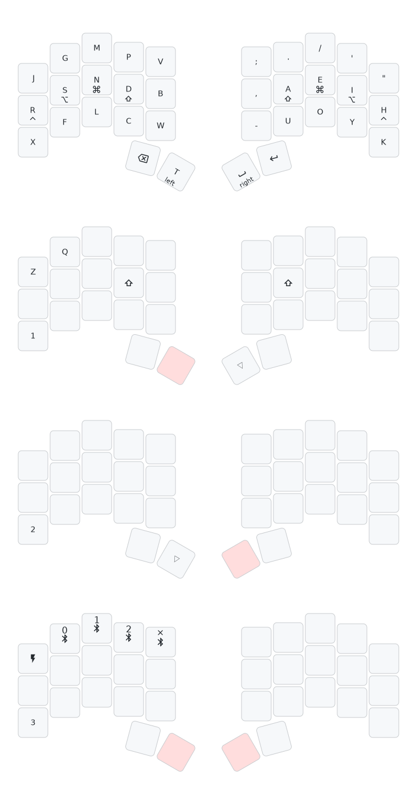

## Keymap



## Commands

Build:

```
zmk-config build choc
zmk-config build choc right
zmk-config build mx
zmk-config build mx right
```

Flash:

```
zmk-config flash choc
zmk-config flash choc right
zmk-config flash mx
zmk-config flash mx right
```

Draw:

```
zmk-draw
```
